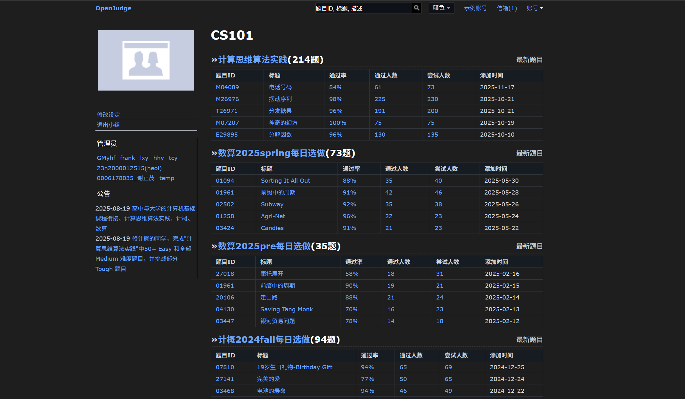
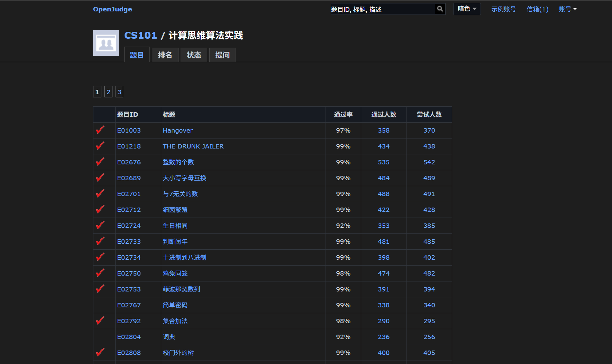
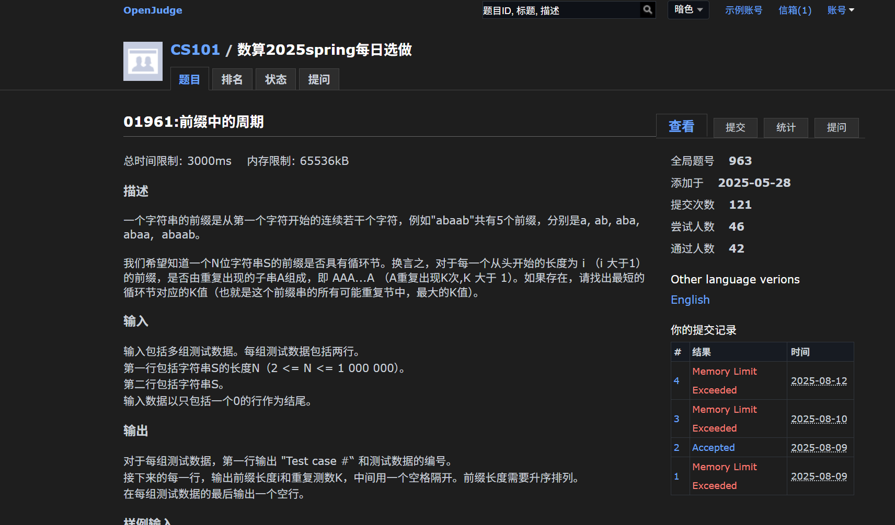
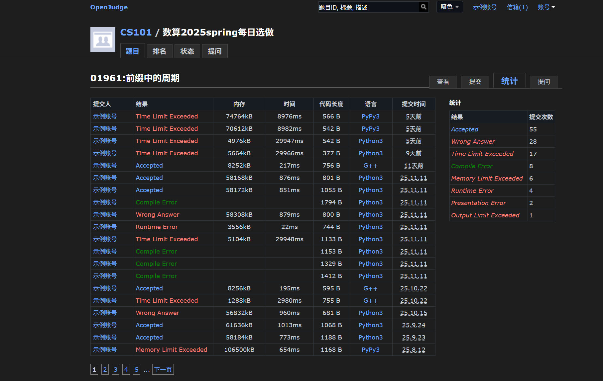
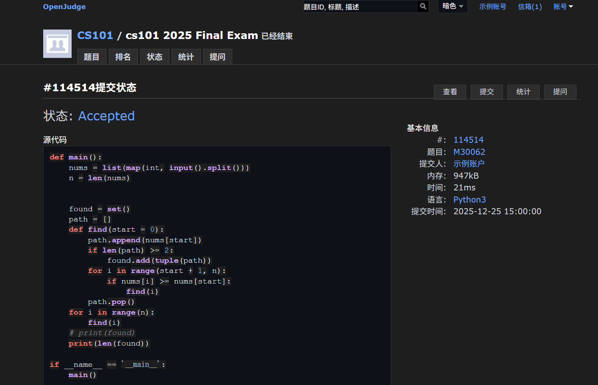
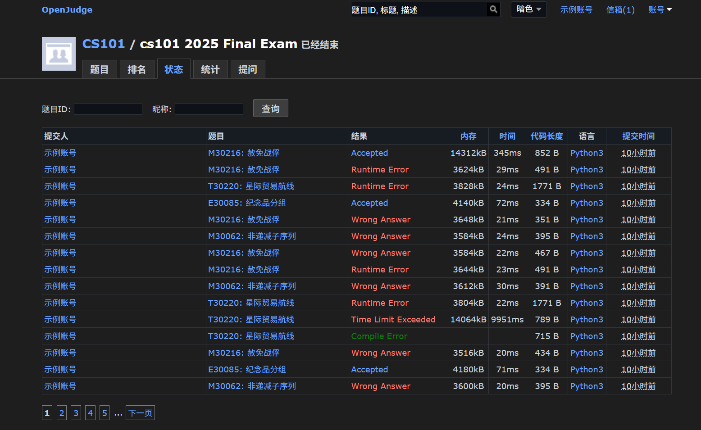
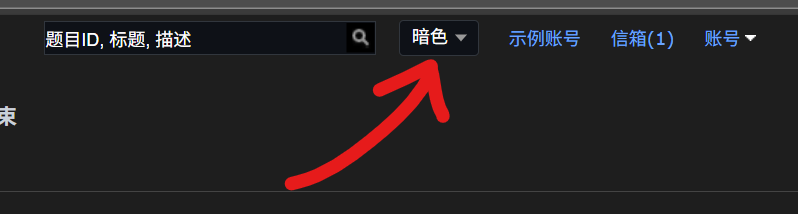

# OpenJudge Dark Mode (OpenJudge 暗色模式插件)

这是一个为 OpenJudge 设计的暗色模式浏览器扩展。

## ✨ 功能特点

- **🌙 深色模式**：精心调优的配色，保护视力，拒绝深夜刺眼白光。
- **⚙️ 无感切换**：直接在搜索框旁集成原生风格的切换开关 (亮色/暗色/跟随系统)。
- **🔍 细节打磨**：修复了搜索按钮、状态栏、提交按钮等数十处细节样式，**这是通用暗色模式插件无法做到的**。

## 🎨 截图预览

<table>
  <tr>
    <td width="50%">
      
       
      
首页

    </td>
    <td width="50%">
      
       
      
题目列表

    </td>
  </tr>
  <tr>
    <td>
      
       
      
题目详情

    </td>
    <td>
      
       
      
统计页面

    </td>
  </tr>
  <tr>
    <td>
      
       
      
运行结果页面

    </td>
    <td>
      
       
      
比赛状态页面

    </td>
  </tr>
</table>

## 📦 如何安装

由于本插件未上架应用商店，请按照以下步骤手动安装（支持 Chrome / Edge / Firefox 等主流浏览器）：

1. 在本页面的右侧 **Releases** 栏目中，下载最新的 `.zip` 压缩包。
2. 解压下载的压缩包，你会得到一个文件夹。
3. 打开浏览器扩展管理页面：
    - **Edge**: 地址栏输入 `edge://extensions`
    - **Chrome**: 地址栏输入 `chrome://extensions`
4. 打开页面右上角的 **“开发人员模式” (Developer mode)** 开关。
5. 点击左上角的 **“加载解压缩的扩展” (Load unpacked)** 按钮。
6. 选择第 2 步解压出来的文件夹。
7. 打开 OpenJudge 网站，享受暗色模式！

## ⚙️ 使用说明

- **无感集成**：本插件没有独立的弹窗界面，我们将开关完美融合进了网页中。
- **默认暗色**：安装即启用暗色模式。
- **切换模式**：请在 OpenJudge 网页顶部的**搜索框右侧**找到下拉菜单，可自由切换“亮色” “暗色”或“跟随系统”。

## 🛠 开发

- `manifest.json`: 插件配置文件
- `content.js`: 核心逻辑脚本
- `dark.css`: 暗色模式样式表
- `ui.css`: 切换开关 UI 样式

## 🤝 贡献

欢迎任何形式的贡献！如果你发现了问题或有改进建议，欢迎提交 Issue 或 Pull Request。

## 📄 License

MIT License